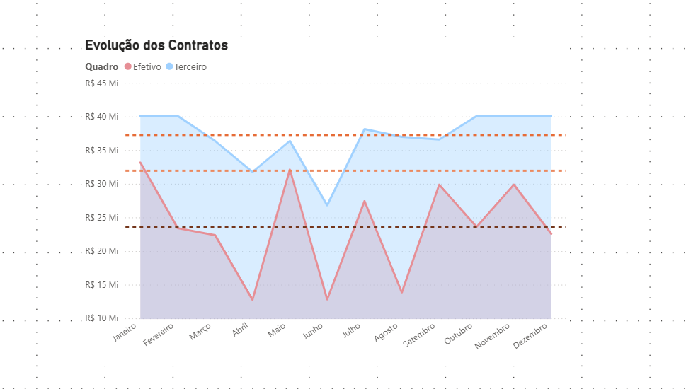
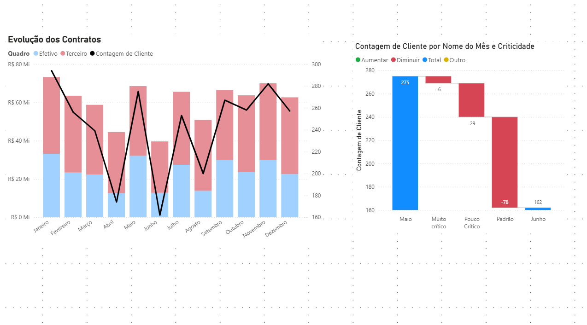
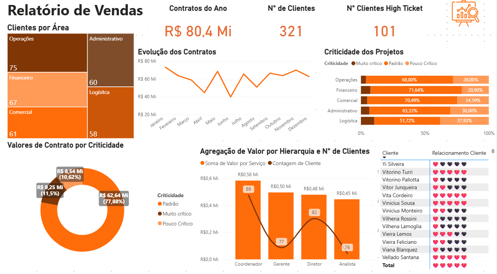

<p align="center">
  
</p>

# 📊 Exemplos de Dashboards de Negócios

Conjunto de visualizações de dados e dashboards desenvolvidos para diferentes necessidades analíticas, incluindo métricas financeiras, evolução de contratos, criticidade de projetos e distribuição de clientes.

---

## 🧠 Sobre o Projeto

Este repositório reúne diversas representações visuais criadas para demonstrar **modelos de dashboards utilizados em ambientes corporativos**.

O objetivo é apresentar **diferentes tipos de gráficos**, suas aplicações e como eles podem contar histórias de forma clara e objetiva em análises de negócio.

As visualizações incluem:

- Gráficos de área e linha  
- Gráficos de barras e colunas combinadas  
- Treemap  
- Donut e gráficos de distribuição  
- Indicadores (KPIs)  
- Análises de evolução, criticidade e comparativos  
- Dashboards completos com múltiplos elementos visuais  

---

## 🧰 Tecnologias Utilizadas

| Tecnologia | Finalidade |
|-----------|------------|
| **Power BI Desktop** | Construção das páginas e design dos dashboards |
| **Modelos Visuais do Power BI** | Criação dos gráficos e indicadores |
| **Ferramentas de Layout** | Composição visual e organização |

---

## 📁 Estrutura do Repositório

```
dashboards-de-negocios/
│
├── dashboards/
│   └── dashboard-de-negocios.pbix       # Arquivo com todo o projeto
│
├── imagens/
│   ├── media_salarial.png
│   ├── evolucao_contratos.png
│   ├── efetivo_terceiro.png
│   ├── dashboard_vendas.png
│
└── README.md
```

---

# 🚀 Como Utilizar

1. Faça o download.
2. Abra o arquivo¹ .pbix utilizando o Power BI Desktop. 
3. Explore cada página do relatório, onde estão organizados os diferentes modelos de gráficos.

¹ Para baixar pela lista de uploads: selecione o arquivo dashboards-de-negocios.pbix e clique na seta ⬇️ no canto direito.

---

# 📸 Exemplos de Dashboards e Visualizações

## 🔹 Média Salarial por Área e Hierarquia


Esse dashboard permite acompanhar a distribuição média dos salários por área e por nível hierárquico. Ele ajuda a identificar discrepâncias, avaliar políticas internas e apoiar decisões de remuneração.

### Áreas que utilizam

- RH / People Analytics

- Departamento Financeiro

- Diretoria Executiva

- Planejamento Estratégico

### Possíveis usos

- Identificar áreas com remuneração fora do padrão.

- Avaliar equidade salarial entre níveis hierárquicos.

- Planejar reajustes e políticas de cargos e salários.

- Apoiar auditorias internas e compliance trabalhista.
---

## 🔹 Evolução dos Contratos


O gráfico mostra a variação mensal dos valores contratados, permitindo visualizar tendências de crescimento, sazonalidade e meses críticos de queda.

### Áreas que utilizam

- Comercial / Vendas

- Financeiro (Receita / Billing)

- Gestão de Projetos

- Diretoria / C-Level

### Possíveis usos

- Identificar meses de maior fechamento de contratos.

- Monitorar estabilidade ou queda no faturamento recorrente.

- Analisar impacto de campanhas e ações comerciais.

- Planejar projeções de receita.
---

## 🔹 Efetivo x Terceiro + Contagem de Clientes


Dashboard que compara valores ou desempenho de equipes internas (efetivo) e terceirizadas, adicionando volume de clientes para enriquecer a análise de capacidade operacional.

### Áreas que utilizam

- Operações

- RH

- Financeiro

- Gestão de Terceiros

### Possíveis usos

- Avaliar custo-benefício entre efetivo e terceirização.

- Medir capacidade operacional por mês.

- Identificar meses com sobrecarga ou subutilização.

- Planejar contratos de outsourcing.

---

## 🔹 Dashboard Completo: Relatório de Vendas


Reúne KPIs essenciais de vendas, criticidade dos projetos, desempenho por área e relacionamento com o cliente.

### Áreas que utilizam

- Comercial / Vendas

- Customer Success

- Marketing Inteligente

- Executivo / Estratégico

### Possíveis usos

- Monitorar performance geral de vendas.

- Classificar clientes por criticidade e risco.

- Acompanhar evolução de contratos.

- Verificar engajamento e relacionamento com clientes-chave.

---

<p align="center">
  ✨ Obrigada por visualizar este portfólio! ✨  
</p>
